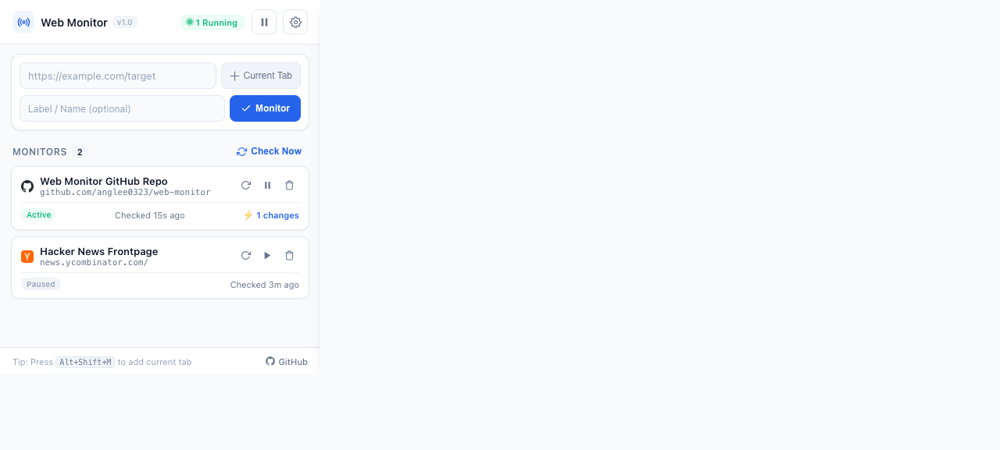
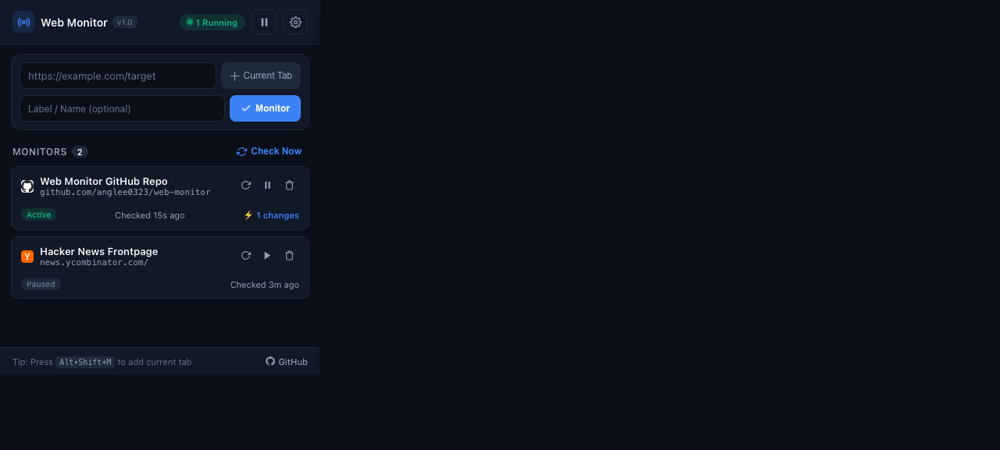

# Web Monitor (网页监控器)

A sleek, lightweight, and high-frequency webpage change detector extension for Chromium browsers (Chrome, Edge, Arc, Brave). Built on Manifest V3.

[English](#features) | [中文说明](#功能特性)

---

## Preview

<p align="center">
  
  
</p>

---

## Features

- **⚡ High-Frequency Monitoring**: Supports ultra-fast check intervals from 5 seconds to 5 minutes.
- **🔔 Multi-Channel Alert System**:
  - **Synthesized Audio Alarms**: Built-in Web Audio API tone synthesis (Chime, Radar, Success, Alert) with zero external media files.
  - **System Notifications**: Native OS-level desktop notification banners.
  - **Standalone Alert Window**: Centered modal popup for critical, can't-miss alerts with keyboard shortcuts (`Enter` to open, `Esc` to dismiss).
  - **Auto-Open Webpage**: Automatically launches the updated page in an active tab.
- **🛡️ Error Recovery Tracking**: Detects when pages recover from server errors (HTTP 404/500/502/timeouts) back to `200 OK`.
- **🧼 Smart Content Normalization & SHA-256 Fingerprinting**: Automatically filters scripts, styles, dynamic timestamps, and session tokens to eliminate false positives.
- **🖱️ Instant Quick Actions**:
  - One-click `Current Tab` button in popup.
  - Right-click any webpage: `Add current page to Web Monitor`.
  - Keyboard shortcut: <kbd>Alt</kbd> + <kbd>Shift</kbd> + <kbd>M</kbd> (Mac: <kbd>Cmd</kbd> + <kbd>Shift</kbd> + <kbd>M</kbd>).
- **🎨 Modern, Minimalist UI**: Clean dark & light mode support, real-time status indicators, and JSON configuration export/import.
- **🔒 100% Private & Local**: Zero analytics, zero external API tracking. Everything executes locally in your browser.

---

## Installation Guide (安装指南)

### Prerequisites
Any Chromium-based browser:
- Google Chrome
- Microsoft Edge
- Brave
- Arc Browser

### Steps
1. Clone or download this repository:
   ```bash
   git clone https://github.com/anglee0323/web-monitor.git
   ```
2. Open your browser and navigate to the Extensions page:
   - Chrome / Arc: `chrome://extensions`
   - Edge: `edge://extensions`
   - Brave: `brave://extensions`
3. Toggle on **Developer mode** (top-right corner).
4. Click **Load unpacked** (加载已解压的扩展程序).
5. Select the `web-monitor` directory.
6. Pin the **Web Monitor** icon to your toolbar for quick access.

---

## How It Works (工作原理)

```
Target URL ──► Service Worker Fetch ──► Smart Normalizer ──► Web Crypto SHA-256
                                                                    │
                                                      ┌─────────────┴─────────────┐
                                                      ▼                           ▼
                                                 Hash Matched               Hash Changed
                                                  (No action)               (Alert Triggered)
                                                                                  │
                                                ┌───────────────────┬─────────────┴─────────────┬──────────────────┐
                                                ▼                   ▼                           ▼                  ▼
                                           Desktop Notif       Web Audio (Offscreen)       Alert Window        Auto-Open
```

1. **Scheduled Fetching**: The background service worker queries the target URL using `cache: 'no-store'` to bypass intermediate CDN caching.
2. **Content Sanitization**: Strips dynamic noise including `<script>`, `<style>`, `<iframe>`, inline timestamps, and CSRF nonces.
3. **Cryptographic Fingerprint**: Generates a standard SHA-256 hash digest.
4. **Change Detection**: When the hash diverges from the previous state, or when a previously offline site returns `200 OK`, alerts trigger across enabled channels.
5. **Offscreen Document Integration**: Uses Chrome's `offscreen` API to keep audio synthesis reliable and sub-minute timers accurate in Manifest V3.

---

## 中文说明

### 功能特性
- **高频极速监控**：支持 5秒、10秒、30秒、1分钟、5分钟等多种检测频率。
- **多通道实时告警**：
  - **合成音频提示**：基于 Web Audio API 原生声学振荡器合成 4 种提示音（门铃、雷达声呐、成功音阶、警报），无需任何外部音频资源。
  - **桌面系统通知**：系统原生浮窗通知，点击直达目标网页。
  - **独立居中弹窗**：关键通知以置顶独立小窗口弹出，支持 `Enter` 快捷键打开、`Esc` 一键关闭。
  - **自动标签页打开**：监测到变动后可选直接新建标签页加载目标页面。
- **服务恢复检测**：针对网站宕机、404、502 或未上线状态，页面一旦恢复正常访问即刻发送上线通知。
- **智能降噪与 SHA-256 指纹**：自动清洗页面中的脚本、内联样式、时间戳与动态 Token，杜绝误报。
- **全局快捷操作**：支持右键上下文菜单一键添加、快捷键快速监控当前页（`Alt+Shift+M` / `Cmd+Shift+M`）。
- **极简现代 UI**：支持深色/浅色自适应模式，提供配置 JSON 导入导出与一键批量管理。
- **纯本地运行**：不收集任何用户隐私数据，无任何远程遥测上报。

---

## Keyboard Shortcuts (快捷键)

| Shortcut | Action |
| :--- | :--- |
| <kbd>Alt</kbd> + <kbd>Shift</kbd> + <kbd>M</kbd> / <kbd>Cmd</kbd> + <kbd>Shift</kbd> + <kbd>M</kbd> | Add current active page to monitor list |
| <kbd>Alt</kbd> + <kbd>Shift</kbd> + <kbd>S</kbd> / <kbd>Cmd</kbd> + <kbd>Shift</kbd> + <kbd>S</kbd> | Toggle monitoring start / pause |

---

## License

Distributed under the [MIT License](LICENSE).
