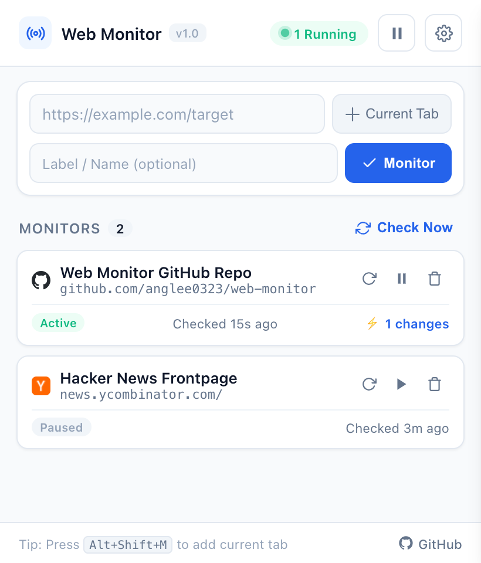

# Web Monitor (网页监控器)

<p>
  <a href="README.md">English</a> | <b>简体中文</b>
</p>

专为极速检测与多通道强力提醒打造的网页变动监控 Chrome 扩展，基于最新 Manifest V3 架构。

<p align="left">
  
  
  
  
</p>

---

## 界面预览

<p align="center">
  
</p>

---

## 核心特性

- **⚡ 高频极速监控**：支持 5秒、10秒、30秒、1分钟、5分钟等灵活的检测频率设置。
- **🔔 多通道联动告警**：
  - **合成声学报警**：内置 Web Audio API 原生声学振荡器，纯代码合成 4 种提示音（门铃、声呐、成功音阶、警报），无需加载任何外部音频媒体文件。
  - **系统桌面通知**：触发原生 OS 系统弹窗通知，点击可直接跳转到目标网页。
  - **独立居中弹窗**：关键通知以置顶独立小窗口弹出，支持键盘快捷键（<kbd>Enter</kbd> 立即打开、<kbd>Esc</kbd> 静音关闭）。
  - **自动加载页面**：检测到变化后可自动在活跃标签页中加载发生更新的网页。
- **🛡️ 服务恢复上线跟踪**：针对网站宕机、HTTP 404/500/502 或维护状态，页面一旦恢复正常访问即刻发送恢复上线通知。
- **🧼 智能降噪与 SHA-256 指纹**：自动清洗页面中的脚本、内联样式、时间戳与动态 Token，杜绝内容未变却频繁误报的情况。
- **🖱️ 全局快捷操作**：
  - 面板一键填入 `Current Tab` 当前标签页的 URL 与标题。
  - 网页任意位置右键菜单：`Add current page to Web Monitor`。
  - 全局快捷键：<kbd>Alt</kbd> + <kbd>Shift</kbd> + <kbd>M</kbd>（Mac: <kbd>Cmd</kbd> + <kbd>Shift</kbd> + <kbd>M</kbd>）。
- **🎨 现代化极简 UI**：自适应深色/浅色模式，直观的状态胶囊与呼吸灯动效，支持配置 JSON 文件的一键导入与导出。
- **🔒 100% 纯本地运行**：不收集任何用户隐私数据，无远程接口上报，所有逻辑与数据均保存在本地浏览器中。

---

## 安装使用指南

### 适用浏览器
任何基于 Chromium 内核的现代浏览器：
- Google Chrome
- Microsoft Edge
- Brave
- Arc Browser

### 安装步骤
1. 克隆或下载本仓库代码到本地：
   ```bash
   git clone https://github.com/anglee0323/web-monitor.git
   ```
2. 打开浏览器扩展管理页面：
   - Chrome / Arc: `chrome://extensions`
   - Edge: `edge://extensions`
   - Brave: `brave://extensions`
3. 开启右上角的 **开发者模式 (Developer mode)**。
4. 点击 **加载已解压的扩展程序 (Load unpacked)**。
5. 选择解压或克隆的 `web-monitor` 文件夹。
6. 点击工具栏的拼图图标，将 **Web Monitor** 固定到浏览器工具栏即可随时使用。

---

## 工作原理解析

```
目标 URL ──► Service Worker 抓取 ──► 智能清洗器 ──► Web Crypto SHA-256
                                                          │
                                            ┌─────────────┴─────────────┐
                                            ▼                           ▼
                                       哈希一致 (无操作)            哈希变更 (触发告警)
                                                                        │
                                      ┌───────────────────┬─────────────┴─────────────┬──────────────────┐
                                      ▼                   ▼                           ▼                  ▼
                                   系统通知            合成音频 (Offscreen)         独立弹窗            自动跳转
```

1. **非缓存请求调度**：后台 Service Worker 使用 `cache: 'no-store'` 发起请求，穿透 CDN 与浏览器本地缓存，获取最新源站响应。
2. **文本结构清洗**：剔除 `<script>`、`<style>`、`<iframe>`、内联时间戳和随机 Token 噪声。
3. **数字指纹计算**：使用 Web Crypto API 原生生成高强度 SHA-256 哈希。
4. **差异与恢复判定**：当 Hash 与基线不同，或页面从错误状态恢复正常时触发多通道联动。
5. **Offscreen 协同架构**：借助 Chrome `offscreen` API 突破 Manifest V3 限制，实现 100% 可靠的后台声学合成与毫秒级定时器调度。

---

## 快捷键列表

| 快捷键 | 功能 |
| :--- | :--- |
| <kbd>Alt</kbd> + <kbd>Shift</kbd> + <kbd>M</kbd> / <kbd>Cmd</kbd> + <kbd>Shift</kbd> + <kbd>M</kbd> | 将当前活跃网页快速添加到监控列表 |
| <kbd>Alt</kbd> + <kbd>Shift</kbd> + <kbd>S</kbd> / <kbd>Cmd</kbd> + <kbd>Shift</kbd> + <kbd>S</kbd> | 全局开启 / 暂停监控引擎 |

---

## 开源协议

本项目基于 [MIT License](LICENSE) 协议开源。
